<div align="center">

 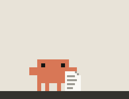 

# Clawd

**Clawd, the Claude Code mascot, as a desktop pet for Linux.**

He lives on your taskbar, climbs your windows, follows what Claude Code is doing,<br>
and reminds you to drink some water.

</div>

Every animation is traced pixel for pixel from Anthropic's official Clawd GIFs, so he
moves the way he does in the Claude apps. The rest (hats, props, the umbrella, the
birthday cake) is drawn on the same pixel grid, in the same palette.

> Unofficial fan project. Clawd and his artwork belong to Anthropic; this project isn't
> affiliated with or endorsed by Anthropic.

- [Install](#install)
- [What he does](#what-he-does): [on his own](#on-his-own) ·
  [with Claude Code](#with-claude-code) · [around your desktop](#around-your-desktop) ·
  [with you](#with-you) · [time and seasons](#time-and-seasons) · [reminders](#reminders)
- [Controls](#controls) · [Settings](#settings) · [Claude Code hooks](#claude-code-hooks)
- [How it works](#how-it-works) · [Development](#development) · [License](#license)

## Install

```bash
git clone https://github.com/ItzSkyeYT/clawd-pet
cd clawd-pet
./install.sh
```

The installer finds PyQt6, or installs it with your package manager (asking first), or,
if it can't, sets up a copy just for Clawd. It adds a `clawd-pet` command and an entry in
your app menu, then asks about starting at login, the Claude Code hooks and, on GNOME, the
helper extension. Nothing is copied: he runs from the folder you cloned, so `git pull`
updates him. `./install.sh --uninstall` takes it all out again.

By hand, he only needs Python 3 and PyQt6:

```bash
sudo pacman -S python-pyqt6       # Arch, CachyOS, Manjaro
sudo apt install python3-pyqt6    # Debian 12+, Ubuntu 22.04+
sudo dnf install python3-pyqt6    # Fedora
sudo zypper install python3-PyQt6 # openSUSE
python3 claude_pet.py
```

Tick **Start at login** in his right-click menu to have him come back each time. Only one
Clawd runs at a time: starting him again brings the running one back into view (handy on
desktops without a system tray).

### Desktops

He runs on any Linux desktop with X11, or Wayland with XWayland: on Wayland he runs
himself through XWayland, because a pet has to place its own window and Wayland doesn't
allow that (the programs he opens get the normal environment back). What he can see of
your desktop depends on what it tells him:

| Desktop | The pointer | Windows to climb | Desktop icons | Wallpaper frights |
|---|:---:|:---:|:---:|:---:|
| KDE Plasma, Wayland | ✓ (a KWin script) | ✓ | ✓ | ✓ |
| KDE Plasma, X11 | ✓ | ✓ | ✓ | ✓ |
| GNOME, Wayland | ✓ with the helper extension | ✓ with the helper extension | | ✓ |
| X11: GNOME, Cinnamon, MATE, XFCE, Budgie, LXQt, i3... | ✓ | ✓ | | ✓ (not LXQt, i3) |
| Hyprland | ✓ | ✓ | | |
| Sway | over X11 apps only | ✓ | | |
| Other Wayland desktops | over X11 apps only | | | |

On GNOME's Wayland session an X11 app can't see the pointer over other apps, nor their
windows, so [a small GNOME Shell extension](gnome/clawd-pet@itzskyeyt.github.io) reports
them (positions and sizes only, never titles or contents). The installer offers it; GNOME
loads new extensions at your next login. Without it he still lives on your taskbar and
does everything else. KDE gets the same from a KWin script he loads himself, Hyprland and
Sway from their own IPC, X11 desktops from the window manager's standard properties.
Desktop icons come from Plasma's layout, which no other desktop publishes.

## What he does

### On his own

When Claude Code isn't busy and you're not playing with him, he gets on with his day.
How often is up to you (Calm, Normal or Lively), and after five quiet minutes he winds
down: longer rests, more naps.

<table>
<tr>
<td align="center" valign="bottom">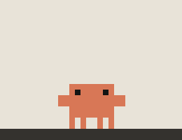<br><sub>Idle: blinks and looks about</sub></td>
<td align="center" valign="bottom"><br><sub>Wave</sub></td>
<td align="center" valign="bottom"><br><sub>Jump</sub></td>
</tr>
<tr>
<td align="center" valign="bottom"><br><sub>Happy jump</sub></td>
<td align="center" valign="bottom"><br><sub>Dance</sub></td>
<td align="center" valign="bottom"><br><sub>Laptop</sub></td>
</tr>
<tr>
<td align="center" valign="bottom">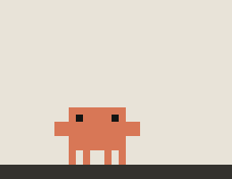<br><sub>Sparkler</sub></td>
<td align="center" valign="bottom"><br><sub>Nap</sub></td>
<td align="center" valign="bottom"><br><sub>Yawn and stretch</sub></td>
</tr>
</table>

<table>
<tr>
<td align="center" valign="bottom">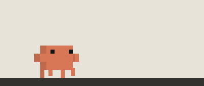<br><sub>Walk</sub></td>
<td align="center" valign="bottom">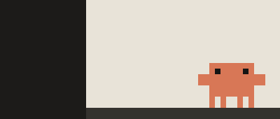<br><sub>Peek in from the edge of the screen</sub></td>
</tr>
<tr>
<td align="center" colspan="2">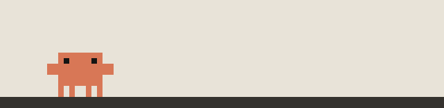<br><sub>Ride his cloud</sub></td>
</tr>
<tr>
<td align="center" colspan="2">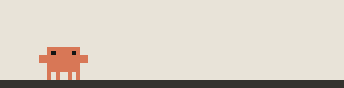<br><sub>Go karting</sub></td>
</tr>
</table>

### With Claude Code

With the [hooks](#claude-code-hooks) installed he follows what Claude Code is doing,
tool by tool, and it always comes first: he drops whatever he was up to.

<table>
<tr>
<td align="center" valign="bottom"><br><sub>Typing while it writes code</sub></td>
<td align="center" valign="bottom"><br><sub>Reading glasses while it reads files</sub></td>
<td align="center" valign="bottom">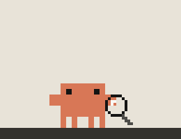<br><sub>A magnifying glass while it searches</sub></td>
</tr>
<tr>
<td align="center" valign="bottom">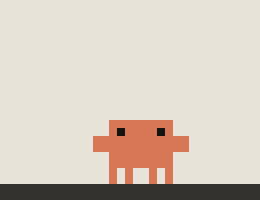<br><sub>Up on his cloud while it browses the web</sub></td>
<td align="center" valign="bottom"><br><sub>Waving you over when it needs a permission</sub></td>
<td align="center" valign="bottom">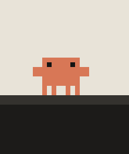<br><sub>Party hat and confetti when it's done</sub></td>
</tr>
</table>

Clicking him opens the Claude app's Code tab, straight to the session that's waiting on
you if there is one (or a terminal running `claude`, without the app).

### Around your desktop

He roams between monitors and treats your windows as furniture: he walks along their
tops, rides them when you move them, climbs up their sides and jumps from one to the
next. Coming down from anywhere high, he floats down under an umbrella or a parachute.

<table>
<tr>
<td align="center" valign="bottom">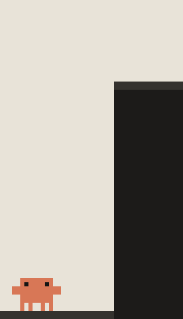<br><sub>A ladder up (or down) to the next screen</sub></td>
<td align="center" valign="bottom">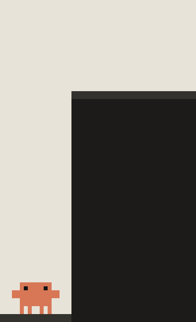<br><sub>Or a leap</sub></td>
</tr>
<tr>
<td align="center" valign="bottom">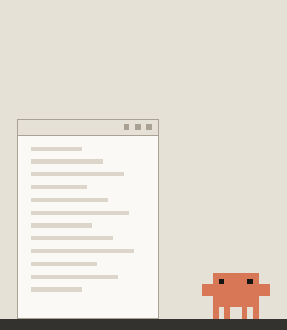<br><sub>Hop up onto a window</sub></td>
<td align="center" valign="bottom">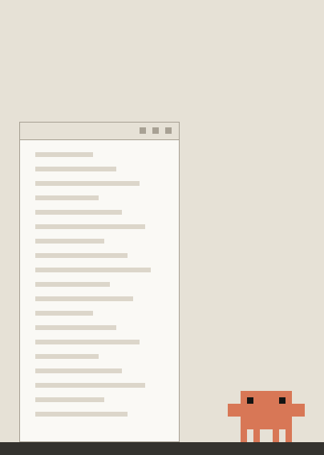<br><sub>Climb up its side, hand over hand</sub></td>
</tr>
<tr>
<td align="center" valign="bottom">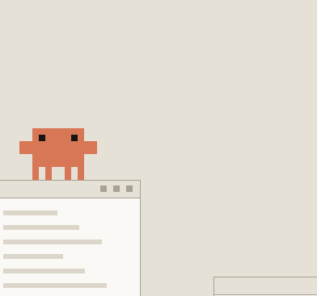<br><sub>Jump from window to window</sub></td>
<td align="center" valign="bottom">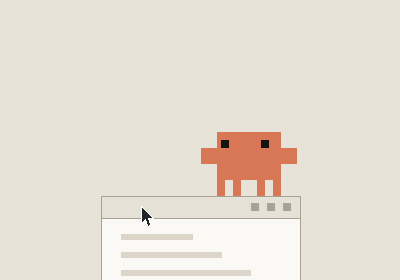<br><sub>Ride a window you move</sub></td>
</tr>
<tr>
<td align="center" valign="bottom">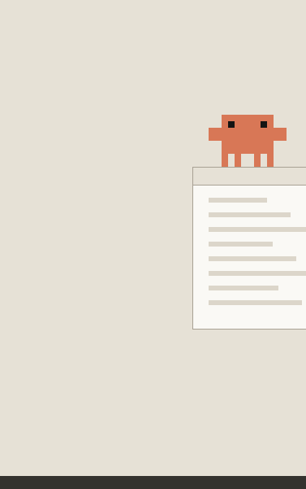<br><sub>Float down under an umbrella</sub></td>
<td align="center" valign="bottom">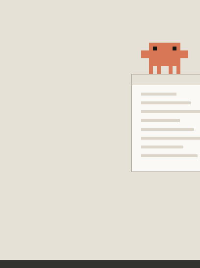<br><sub>From higher up: skydive, then pull the cord</sub></td>
</tr>
<tr>
<td align="center" valign="bottom">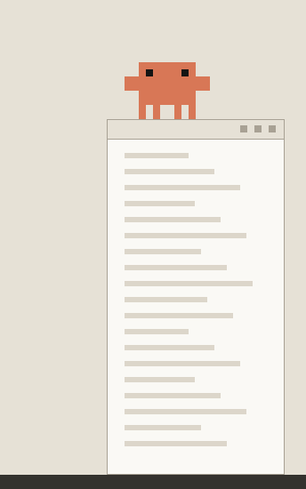<br><sub>Climb down a window's side</sub></td>
<td align="center" valign="bottom">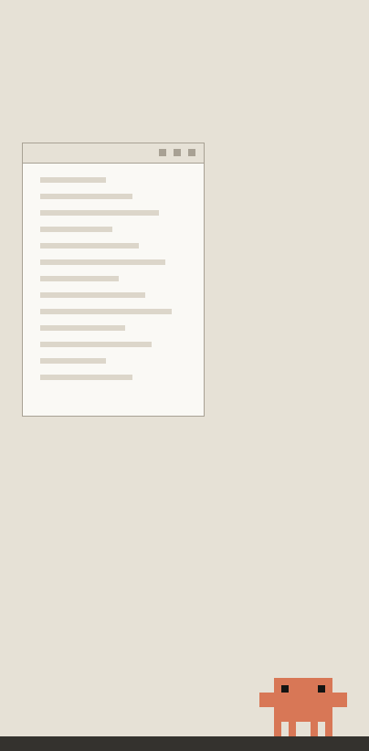<br><sub>A ladder up to a window out of reach</sub></td>
</tr>
<tr>
<td align="center" valign="bottom">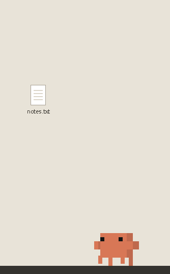<br><sub>Check out a desktop icon: puzzled, a poke,<br>the magnifying glass, a verdict</sub></td>
<td align="center" valign="bottom">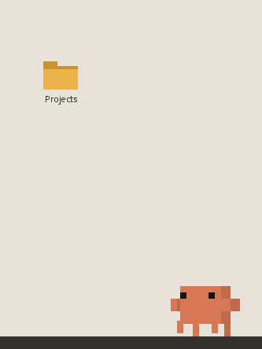<br><sub>Pull a page from a desktop folder<br>and read it like a story</sub></td>
</tr>
</table>

He ducks out of sight while something is fullscreen on his screen, and a new wallpaper
(a slideshow turning over, say) gives him a fright.

### With you

<table>
<tr>
<td align="center" valign="bottom">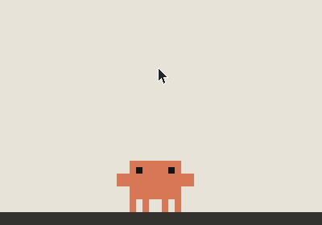<br><sub>He watches the pointer</sub></td>
<td align="center" valign="bottom">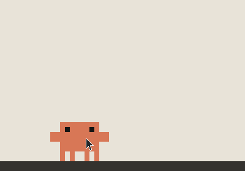<br><sub>Pet him: hearts, then a dance</sub></td>
</tr>
<tr>
<td align="center" valign="bottom">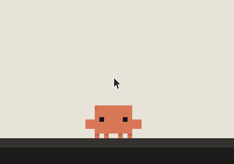<br><sub>Hold the pointer above him and he grabs it<br>(shake it to get him off)</sub></td>
<td align="center" valign="bottom">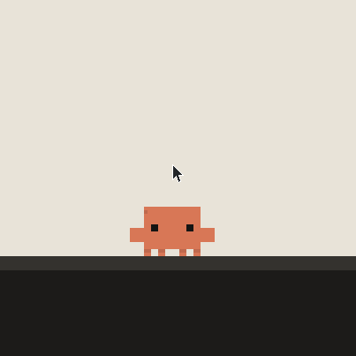<br><sub>Whirl it and he spins right round,<br>and sees stars</sub></td>
</tr>
<tr>
<td align="center" valign="bottom">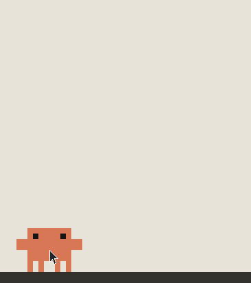<br><sub>Pick him up and throw him</sub></td>
<td align="center" valign="bottom">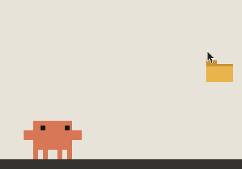<br><sub>Drop a folder on him to start<br>a Claude Code session there</sub></td>
</tr>
</table>

### Time and seasons

From the clock: sleepier at night, a stretch and a coffee in the morning, and a hat for
the season.

<table>
<tr>
<td align="center" valign="bottom">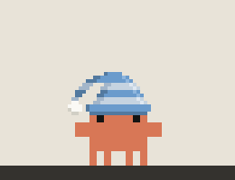<br><sub>His nightcap, all night</sub></td>
<td align="center" valign="bottom">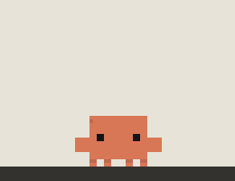<br><sub>Good morning: a stretch and a coffee</sub></td>
<td align="center" valign="bottom">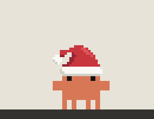<br><sub>A Santa hat in December</sub></td>
</tr>
</table>

<table>
<tr>
<td align="center" valign="bottom">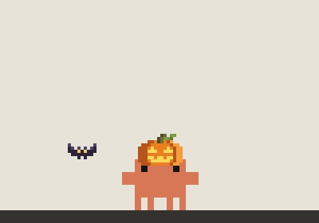<br><sub>A pumpkin and bats before Halloween</sub></td>
<td align="center" valign="bottom">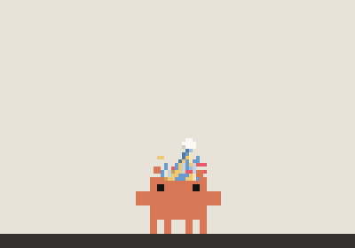<br><sub>New Year: party hat, confetti, a dance</sub></td>
</tr>
<tr>
<td align="center" valign="bottom">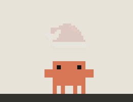<br><sub>Hats change with a flourish</sub></td>
<td align="center" valign="bottom">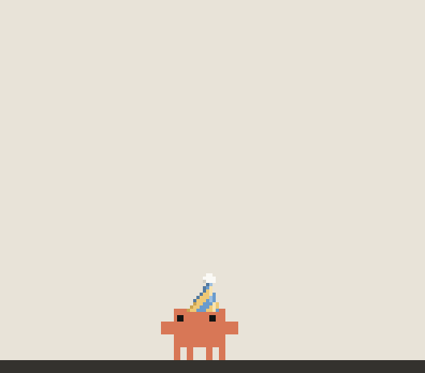<br><sub>Your birthday (set it in Settings): he grows to twice his size,<br>then balloons, a banner, a cake with candles, a wish</sub></td>
</tr>
</table>

### Reminders

A reminder stays up until you press its **Done** button: through dragging, fullscreen and
even a restart. He comes to the middle of the screen you're working on (climbing the
ladder if he has to), makes a fuss for two minutes, then waits quietly.

<table>
<tr>
<td align="center" valign="bottom">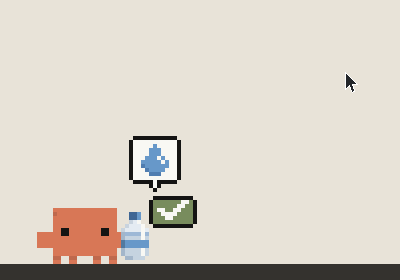<br><sub>Water: a bottle held out until you press Done,<br>then he has a drink</sub></td>
<td align="center" valign="bottom">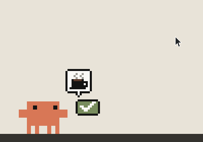<br><sub>A break: then a coffee with you</sub></td>
</tr>
</table>

<table>
<tr>
<td align="center" valign="bottom"><br><sub>A new wallpaper gives him a fright</sub></td>
<td align="center" valign="bottom">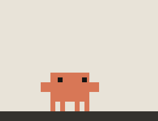<br><sub>Open his settings and he reads along,<br>reacting to every change</sub></td>
</tr>
</table>

## Controls

| Do this | And |
|---|---|
| **Left-click** | Open Claude Code (the Code tab of the Claude app, or `claude` in a terminal) |
| **Right-click** | His menu: Claude Code, Play (every scene above), hat, size, quiet mode, settings, start at login, restart, quit |
| **Drag** | Pick him up. Let go and he falls; throw him and he bounces |
| **Pet** | Move the pointer back and forth over him |
| **Hold the pointer above him** | He grabs it. Whirl it round, or shake it to get him off |
| **Drop a folder on him** | A new Claude Code session in that folder |
| **Tray icon** | Click to hide or show him |

**Play goes and does it.** Pick "Hop down from a window" while he's on the floor and he
climbs onto one first; pick "Check out a desktop icon" on a screen without icons and he
takes the ladder over to the one that has them. If there's nothing to do it with, you
get a puzzled "?".

## Settings

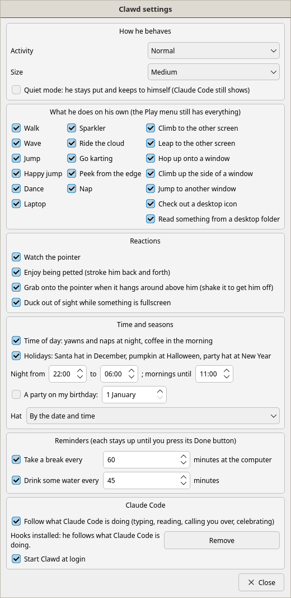

Right-click → **Settings…** Everything applies at once.

- **How he behaves**: how lively he is (Lively means barely a second's rest between
  scenes), his size, and quiet mode (he stays put; Claude Code still shows)
- **What he does on his own**: untick what you'd rather he didn't do by himself. The
  Play menu keeps everything
- **Reactions**: watching the pointer, being petted, grabbing the pointer, ducking out
  of fullscreen apps
- **Time and seasons**: night and morning hours, holiday hats, a birthday party, or
  pick a hat to wear all the time
- **Reminders**: how often you'd like to be told to take a break, or drink some water
- **Claude Code**: follow it or not (without touching the hooks), install or remove the
  hooks, start at login

<br clear="right">

## Claude Code hooks

```bash
python3 tools/install_hooks.py            # adds them to ~/.claude/settings.json
python3 tools/install_hooks.py --remove   # takes them out again
```

The hooks are asynchronous, so they can't slow Claude Code down, and `clawd_hook.py`
sends only event, tool and session names (never your prompts, files or commands) over a
local socket at `$XDG_RUNTIME_DIR/clawd-pet.sock`. The settings dialog can install them
too.

The socket also takes commands, handy for scripts and testing:

```bash
echo '{"cmd": "play", "action": "dance"}' | nc -U "$XDG_RUNTIME_DIR/clawd-pet.sock"   # OpenBSD netcat
echo '{"cmd": "play", "action": "dance"}' | socat - "UNIX-CONNECT:$XDG_RUNTIME_DIR/clawd-pet.sock"
```

`status`, `restart` (he re-execs himself, which also picks up code changes) and
`set` (any setting, e.g. `{"cmd": "set", "pref": "quiet", "value": true}`) work too.

## How it works

- One Python file, [`claude_pet.py`](claude_pet.py), and PyQt6. His window is shaped to
  his pixels, so clicks go through everywhere else.
- Sprites are text: [`sprites/clawd.json`](sprites/clawd.json) holds the traced official
  frames as rows of palette keys, and [`sprites/extras.py`](sprites/extras.py) and
  [`sprites/birthday.py`](sprites/birthday.py) the hand-drawn extras, read as plain data.
- Behaviours are generators that yield how long to wait; the physics (gravity, bounces,
  swinging from the pointer, the parachute) runs in small fixed steps, whatever the
  frame rate.
- Your windows and the pointer come from whatever your desktop offers (see
  [Desktops](#desktops)): a KWin script or the GNOME extension over D-Bus, Hyprland's and
  Sway's IPC sockets, or X11's EWMH properties read straight from libX11.
- More detail in [ARCHITECTURE.md](ARCHITECTURE.md).

## Development

```bash
python3 -m unittest discover -s tests -v   # offscreen, nothing appears on screen
node gnome/test.mjs                        # the GNOME extension, against a fake GNOME Shell
python3 tools/make_media.py                # redraws every GIF in this README
```

The tests run the real behaviours on a fake two-screen desktop. The GIFs are made the
same way, on a mock desktop, so they only change when Clawd does.
`tools/fetch_official.py` and `tools/trace_official.py` download the official Clawd
GIFs and trace them into `sprites/clawd.json`.

## License

The code is [MIT](LICENSE): use it however you like. The artwork (the sprites, and the
GIFs in this README) is not: it's all rights reserved, and using it anywhere but Clawd
itself needs my permission. [LICENSE-ASSETS.md](LICENSE-ASSETS.md) has the details.
Clawd himself belongs to Anthropic.
